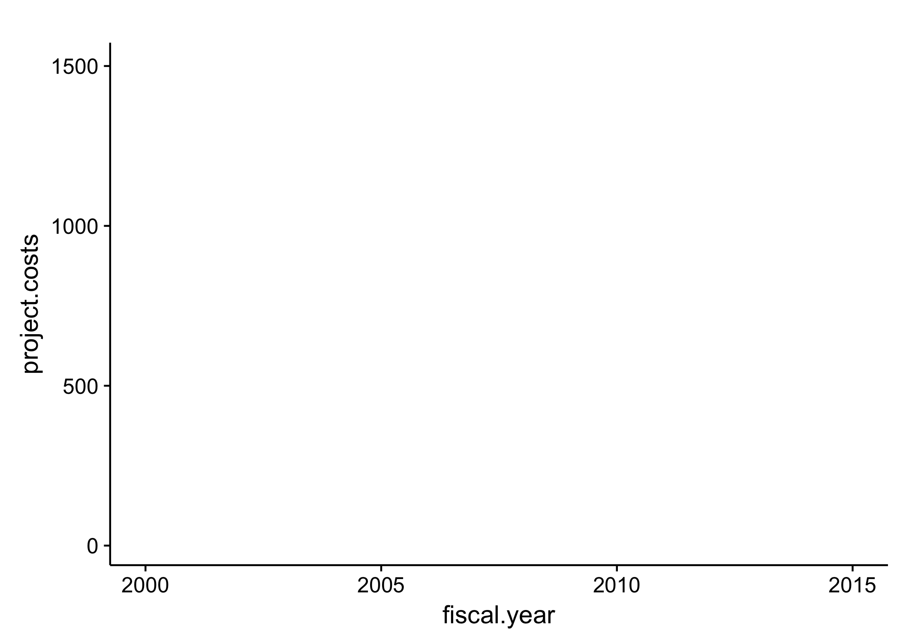

```{r setup, include=FALSE}
knitr::opts_chunk$set(echo = TRUE, comment = "#>")
```

# Submission


1. Fork this repository to your own account
1. Make changes to the `README.Rmd` file (including the author field above).
1. Knit the file to HTML format
1. Publish HTML on Rpubs (you will need to sign up for the free account) and *add the link below*.
1. Submit a PR with your answers.

*Link to Rpubs document:* [heres my document](http://rpubs.com/cmkiekha/264211)

# Overview

Take the [datacamp course on joining data](https://www.datacamp.com/courses/joining-data-in-r-with-dplyr) to learn the join verbs.

You will analyze some data in the [`nihexporter`](https://github.com/jayhesselberth/nihexporter) package to answer some questions. The questions will cover methods in `dplyr` including two-table verbs.

First you need to install the `nihexporter` package (and `devtools`, if you don't have it already).

```{r eval=FALSE}
#install.packages('devtools')
# devtools::install_github("jayhesselberth/nihexporter")
```

#Read the [Overview vignette](http://jayhesselberth.github.io/nihexporter/articles/nihexporter.html) to learn the structure of the pacakge. Take a look at two tables from the package:

```{r}
library(nihexporter)
library(tidyverse)
library(broom)
projects
project_io
```

# Problems

## Problem 1

The `projects` and `project_io` tables have the `r intersect(names(projects), names(project_io))` column in common. Use this column to perform a `left_join` and identify the most expensive project for each institute. Project institutes are in the `projects` table, whereas total project costs are available in the `project_io` table. Note you will have to use the `arrange` and `slice` verbs from `dplyr`.

```{r problem_1}

library("tidyverse")
projects %>%
  select(project.num, institute) %>%
  left_join(project_io) %>% 
  select(project.num, institute, total.cost) %>% 
  group_by(institute) %>% 
  arrange(desc(total.cost)) %>%
  slice(1:1) %>%
  arrange(desc(total.cost))

```


## Problem 2

Create a plot that describes the change in output (number of publications) for the most expensive grant from the above list. Note that you cannot use `n.pubs` for this, as that is an aggregate count over time. You need a tbl of following structure, which you can then use to calculate the number of publications each year (hint: use `n()` in a `summarize` statement:

```{r p2_tbl}
projects %>% 
  select(project.num, institute) %>%
  left_join(project_io) %>% 
  select(project.num, institute, total.cost) %>% 
  group_by(institute) %>% 
  arrange(desc(total.cost)) %>%
  slice(1:1) %>%
  arrange(desc(total.cost)) %>%
  ungroup %>% 
  slice(1:1) -> expensive_project
```
```{r problem_2}
projects %>% 
  semi_join(expensive_project) %>%
  left_join(publinks) %>%
  left_join(publications) %>%
  select(project.num, pub.year, fy.cost, pmid) %>%
  na.omit() %>%
  group_by(pub.year) %>%
  summarize(total.pubs = n()) -> total_pubs
            
   ggplot(total_pubs, aes(pub.year, total.pubs)) +
     geom_point()
            
```
## Problem 3

Use the `projects` and `clinical_studies` table to calculate how many clinical studies have been started by projects from each institute.

```{r problem_3}

library("tidyverse")

projects %>%
  select(project.num, institute) %>%
  left_join(clinical_studies) %>% 
  select(project.num, institute, trial.id) %>% 
  na.omit() %>%
  group_by(project.num) %>% 
  summarize(total.trials = n()) -> total_trials
  
```

## Problem 4

Calculate correlations between `total.cost` and `n.pubs` for each institute. You will need to `join` the `projects` and `project_io` tables to link `institute` with `total.cost` and `n.pubs`. You will then need to use `group_by` and `do` from `dplyr` and `tidy` from `broom` to calculate correlations.

```{r problem_4}
projects %>% 
  select(project.num, institute) %>%
  left_join(project_io) %>% 
  select(n.pubs, institute, total.cost) %>% 
  group_by(institute) %>% 
  do(tidy(cor(.$total.cost, .$n.pubs)))
```  
#Commands below are written by Jay for problem_4.  
tab %>%
  group_by(...) %>%
  do(tidy(cor(..., ...)))


## Problem 5 (extra credit)

Correlate [`rcr`](https://icite.od.nih.gov/) values from the `publications` table to one of:

- total cost (overall for NIH, or by institute)
- budget mechanism (e.g., RFA, PAR, etc.)
- type of grant (e.g. R01, P01, R21, etc.). 

I will calculate correlations between `total.cost` and `rcr` for each institute.  I will first `join` the `projects` and `project_io` tables to link `institute` with `total.cost`. Next, I hen need to use `group_by` and `do` from `dplyr` and `tidy` from `broom` to calculate correlations.

```{r extra_credit}
res <- 
  projects %>% 
  select(project.num, institute) %>%
  left_join(project_io) %>% 
  select(project.num, institute, total.cost, n.pubs) %>% 
  group_by(institute) %>% 
  left_join(publinks) %>%
  left_join(publications) %>%
  select(institute, total.cost, n.pubs, rcr) %>%
  na.omit() %>%
  group_by(institute) %>%
  do(tidy(cor.test(.$total.cost, .$n.pubs)))
res
  # arrange(desc(total.cost)) 
  
```

## Problem 6 (extra extra credit)

Use [`gganimate`](https://github.com/dgrtwo/gganimate) to illustrate the change in cost of R01s for a few institutes over time.

In problem_1 above, we calculated the most expensive project for each institute and then arranged in descending order ( arrange(desc(total.cost).  For this problem, I have selected the top six institutes with the most expensive projects to illustrate the change in cost of RO1s over time.  These are as follows: LM, CA, HG, AG, DK RR.

```{r extra_extra_credit}

library(nihexporter)
library(dplyr)
library(ggplot2)
library(gganimate)
library(cowplot)
# install.packages('magick')

insts <- c('LM', 'CA', 'HG', 'AG', 'DK', 'RR')
activities <- c('R01')

costs_RO1s <- projects %>%
  filter(institute %in% insts & activity %in% activities) %>%
  group_by(fiscal.year, institute, activity) %>%
  summarize(n.projects = n(),
            project.costs = sum(fy.cost, na.rm = TRUE) / 1e6)

p <- ggplot(costs_RO1s, aes(fiscal.year, project.costs, frame = fiscal.year)) + geom_point()

animate <- gganimate(p, "filename.gif")
```

This is a summary of my data:



